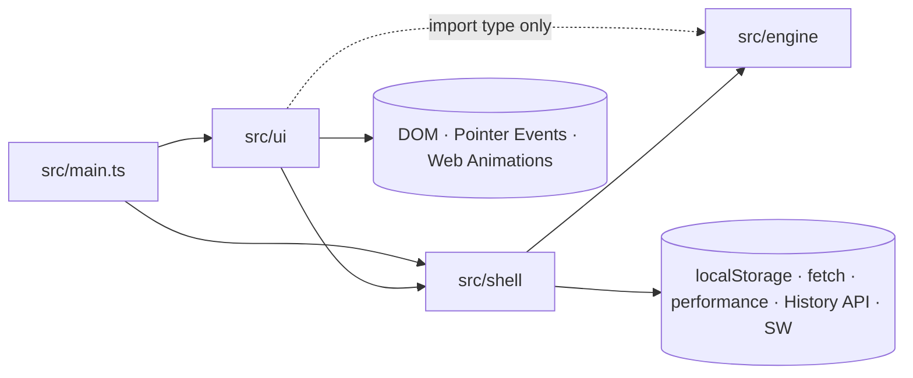
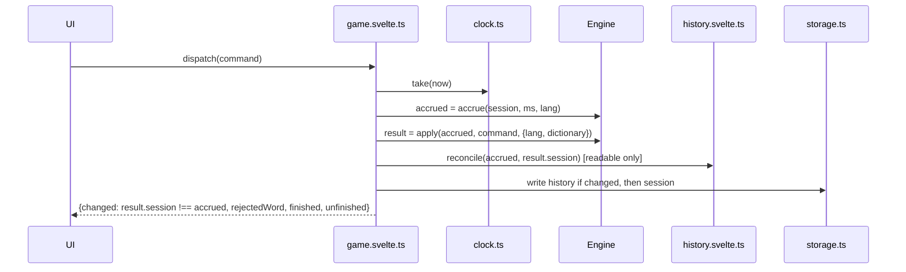
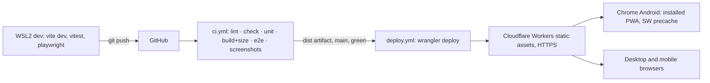

# Architecture Spine — WordCell

Rule ids (R-xx), decisions (Q-xx) and §-references are `docs/game-flow-spec.md` v0.7. UX
assumption ids (A-Dn, A-En) are DESIGN.md and EXPERIENCE.md. This spine does not restate or
reopen any of them; where a rule and this spine seem to disagree, the rule wins and this spine
has a bug. The stack is decided in `docs/platform-decision.md` §3 and is cited, not re-argued.
The repository already holds a scaffold (commit `785c0f6`); ADs that ratify it are tagged
`[ADOPTED]`, and every place where the scaffold must change is listed under Scaffold deltas.
The ADs and Consistency Conventions below are the rules `bmad-project-context` records in the
AGENTS.md block.

## Design Paradigm

**Functional core, imperative shell, event-sourced.** The game is a value (`Session`, spec §2);
every position is `replay(seed, moves)`; every player action is a pure function
`Session → Session`. Everything with an effect (storage, clock, fetch, History API, service
worker) sits in a thin shell around it; Svelte renders what the shell exposes.

| Layer | Directory | Owns | May import |
| --- | --- | --- | --- |
| Core | `src/engine/` | Every engine sentence of spec §2–§6, replay, derived view, scoring, bands, score-history semantics, (de)serialisation and version checks, language data | only `src/engine/**` (relative); engine tests also `vitest` and JSON under `fixtures/` |
| Shell | `src/shell/` | Game store and dispatch, score-history store, stateless storage functions, dictionary load, clock, seed, preferences and motion, History API adapter, service-worker registration, test hook | `src/engine/index.ts`, browser APIs |
| UI | `src/ui/` | Svelte components, overlay state, layout geometry and band order, gestures and drop targeting, keyboard map, animations | `src/shell/**`, `import type` from `src/engine/index.ts` |
| Entry | `src/main.ts` | Boot order (AD-16), global error handler (AD-15) | everything |



## Invariants & Rules

### AD-1 — Engine purity and layer rules, enforced mechanically

- **Binds:** `src/**`, brief §6.5, CLAUDE.md rule 1.
- **Prevents:** a DOM, clock, random or I/O dependency creeping into the rules (breaking replay
  determinism and Vitest-only reproduction, brief §6.6); a layer importing across the table.
- **Rule:** Three checks, all in `npm run test:all` and CI:
  1. `src/engine/tsconfig.json` type-checks engine sources (tests excluded) with
     `lib: ["ES2023"]` and `types: []`, so any DOM or Node global is a type error;
     `npm run check` runs it.
  2. `src/architecture.test.ts` (Vitest) scans every file under `src/**` except itself: it reads
     import specifiers, then strips comments, regex literals and string literals (of a template
     literal only its literal parts, keeping `${ }` expressions; fixture case
     `` `${Date.now()}` ``), then matches syntax, not substrings:
     - engine sources (not `*.test.ts`) must not match
       `\b(Math\.random|Date|performance|crypto|setTimeout|setInterval|requestAnimationFrame|fetch|localStorage|sessionStorage|globalThis|window|document|process|console)\b`,
       and may not use computed member access on `Math` (`Math[`);
     - engine files import only relative paths inside `src/engine/`; engine test files may also
       import `vitest` and JSON from `fixtures/` (`import … with { type: 'json' }`);
     - shell and UI import the engine only through `src/engine/index.ts`, and UI imports from it
       are `import type` only;
     - only `src/shell/nav.ts` matches
       `\b(window\.)?history\s*\.\s*(pushState|replaceState|back|forward|go|state|length)\b` or the
       literal event name `popstate` (checked before strings are stripped), or declares an import
       binding or variable named `history`; the score history keeps its names
       (`scoreHistory`, `reconcileHistory`, `wordcell:history`);
     - only `src/shell/storage.ts` matches `\blocalStorage\b`;
     - `*.test.ts` files in shell and UI are exempt from the `localStorage` and History API
       ownership checks.
  3. Biome `noRestrictedGlobals` for `src/engine/**` denies the plain identifiers of that list
     for editor feedback (Biome cannot deny `Math.random`); the Vitest scan is the authority.

### AD-2 — Engine command API

- **Binds:** engine ↔ shell boundary, R-10…R-85, CLAUDE.md rules 2–3.
- **Prevents:** UI code computing legality or mutating game data; two call shapes for one
  command; an engine test and a UI test disagreeing on whether an input is a no-op or a bug; the
  dictionary, clock or seed entering the engine any way other than as data.
- **Rule:** `src/engine/index.ts` is the only public surface and exports:
  - `createSession(seed: number): Session` (R-04, R-74).
  - `apply(session, command, ctx): ApplyResult` with `ctx = { lang: LangData; dictionary?:
    ReadonlySet<string> }` and `ApplyResult = { session: Session; rejectedWord?: string }`.
    `command` is a discriminated union on `type`: `drop { sourceColumn, sourceCount,
    destinationColumn }`, `tapDestinationCard { card }` (R-31 tap mapping, including "top of D
    → k − 1"), `setDestinationCount { k }` (plus/minus and keys), `flip`,
    `addFreeLetter { cell, index? }`, `removeFreeLetter { cell }`, `arrange { arrangement }`,
    `validate`, `setTarget { cell }`, `setPlacementOrder { order }`, `confirm`, `undo`, `redo`,
    `giveUp`. Columns are 1-based, cells 3–10, cards `CardId` (spec §2).
  - **No-op by value.** A command whose result leaves every stored field equal **by value**
    (element by element) to the input returns the input reference unchanged and does not touch
    `reached` or the redo tail (R-71). The comparison is made on the draft's data fields and
    `cursor`/`gaveUp` (excluding `reached` and the redo tail) before any R-71 lowering or discard
    is applied. A failed Validate returns the input reference plus
    `rejectedWord` (the R-37 word string). `validate` without `ctx.dictionary` throws.
  - **Command table.** `src/engine/commands.test.ts` opens with one table, the source of truth;
    the epic 2 spec links to it rather than copying it. It gives every command × precondition as **no-op** (same reference) or **throw**
    (`EngineError`). Fixed here: `flip` with k = 0 → no-op (R-31); `tapDestinationCard` on the
    top of D at k = 1 → no-op (R-31); on an empty destination column every
    `setDestinationCount` → throw (the UI never dispatches it there, R-31); on a non-empty
    column, equal to k → no-op, outside 1…n → throw; `addFreeLetter` on a used or empty cell, or with
    `index` outside 0…|M| → throw; `removeFreeLetter` on a cell not in `freeLetters` → throw;
    `tapDestinationCard` on any card that is not in the destination column after R-21 (including
    an S card, whose source-column mirror shows the DESIGN.md ghost state, AD-14) → throw; `drop` with `sourceCount` 0, larger than the
    column, or from an empty source column → throw; `validate` while the structural check fails
    → throw;
    `setTarget` equal to the current target → no-op, not legal → throw; `arrange` /
    `setPlacementOrder` equal in value → no-op, not a permutation of the right set → throw;
    any command other than `undo` while status ≠ playing → throw; nothing to undo, no redo data,
    a command in the wrong phase → throw (spec §4 preamble); any id or number outside its
    documented domain (columns 1–8, cells 3–10, `CardId` 0–51, k an integer, seed a uint32 in
    `createSession`) → throw. The spec's UI-level no-ops (a tap
    on a used cell, a press at a bound) are realised by the UI **not dispatching**, gated by
    `GameView` flags (AD-3); a throw always means a bug.
  - `accrue(session, elapsedMs, lang): Session` (status derivation needs the deck) adds to `activeMs` only while status = playing
    (R-76); while status ≠ playing, and for `0`, it returns the input reference; a non-integer or negative `elapsedMs` throws.
  - `view(session, lang): GameView` (AD-3); `letterCount(card, lang)` (R-85); the history
    functions of AD-6; `serializeSession`, `parseSession(text, lang)`, `serializeHistory`,
    `parseHistory(text)` (AD-7); `SESSION_VERSION`, `HISTORY_VERSION`; `EN: LangData` (distribution, letter values,
    R-85).
  - All engine values are immutable (`readonly` types); the engine never mutates an argument.

### AD-3 — `GameView` is the only source of derived game state

- **Binds:** every UI component, R-12, R-31, R-39, R-75, R-81–R-83, EXPERIENCE.md Component
  Patterns and phase matrix.
- **Prevents:** a component re-deriving columns, legality, inertness, score or enablement and
  disagreeing with the engine (the BGA desync class of bug, carryover §7).
- **Rule:** `view()` returns, derived by replay: `status`, `phase`; `faces` indexed by `CardId`
  (`{ letter, letterCount }` from `LangData`); columns (top→bottom) and WordCells (bottom→top)
  as `CardId` lists; per column `canPickUp`, `canDropOn`, `canTapForK` and, for the destination
  column in Composing, `kIfTapped: ReadonlyMap<CardId, number | null>` (`null` = the UI does not dispatch, a UI-level
  no-op per AD-2, while the engine no-op stays the tested contract; tap,
  `Enter`/`Space` and the hover preview all read it; a card absent from it is inert: no
  dispatch, no hover preview); per cell `used`, `canAddFreeLetter`,
  `canSetTarget` (phase = place and `isLegalTarget` and cell ≠ target), `isLegalTarget`; the draft (S, D, k, side, `arrangement`, free letters, word
  string, letter count, structural check result with its reason); Place data (legal targets,
  target, placement order, score delta per EXPERIENCE.md Word line); `liveScore` (R-80 over committed WordCells), `displayScore` (top bar: `liveScore`
  while playing, the final score after R-81 when status ≠ playing), final score, penalty, `lettersLeft` and band (all absent while status = playing), longest word, word count, pending-draft word (present only while status = playing and phase = Idle); and `canUndo`,
  `canRedo`, `canGiveUp`, `canValidate` (structural), `canConfirm`, `canFlip`, `canDecK`,
  `canIncK`; `inProgress` (status = playing and `moves.length > 0`, spec §2), the only flag the
  New game / Replay confirmation (including the `N` key) reads. A component combines a `GameView` flag only with state outside the engine (shell:
  dictionary, AD-8; UI: tail and tile selection, overlays). No UI module holds a letter
  table, a rule constant or a phase/status → legality mapping.

### AD-4 — One writer: the game store, its states and dispatch

- **Binds:** `src/shell/game.svelte.ts`, R-38, R-71, R-73, R-74, R-76, R-84, spec §2,
  CLAUDE.md rule 2.
- **Prevents:** a second state holder; a save that misses a change; an overwrite of a rejected
  save; Session and score history disagreeing after a finish or un-finish; the invalid-word line
  clearing on a no-op.
- **Rule:**
  - The store's state is `{ kind: 'booting' } | { kind: 'rejected'; reason } | { kind: 'active';
    session } | { kind: 'halted' }` in a `$state.raw` rune, initially `booting` (dispatch throws,
    nothing written); the load enters `active` or `rejected`, an error `halted` (AD-15). `view`
    is `$derived` while `active`. It is the only
    module that calls `apply`, `accrue` or `createSession`.
  - `dispatch(command): DispatchResult = { changed: boolean; rejectedWord?: string; finished?:
    'won' | 'gaveUp'; unfinished?: true }` is the only
    way a player action reaches the engine; outside `active` it throws. Key handling is off
    while `rejected` or `halted` (the rejected root handles only its own button natively). It
    runs synchronously in one task:



  - `changed` compares against the **accrued** session, so time alone never counts as an edit.
    `finished` / `unfinished` come from the same before/after status comparison `reconcile` uses
    (playing → won or gaveUp; not playing → playing).
    The store owns `feedback.rejectedWord` (`$state`, never persisted): set on a failed
    Validate, cleared on any dispatch with `changed = true`, on New game and on Replay. UI state
    that ends "on any edit" (tile selection) keys off `changed`; tile selection also ends on any
    enabled-control press before its dispatch (a failed Validate included), whatever `changed`
    says.
  - Writes happen after every dispatch where `apply` or `accrue` produced a new reference, and on
    the flush (AD-9). Nothing is written while `rejected` or `halted`.
  - New game and Replay this deal (and New game from `rejected`) call
    `clock.take(performance.now())` and discard the result, then `createSession`, enter `active`,
    then write it at once, and never touch the score history (Q-29, R-74 `activeMs = 0`). The
    UI's New game / Replay handler also calls `overlays.resetForNewSession()` (AD-13).
  - Finish and un-finish write the history first, then the Session. If the Session write fails
    after the history write succeeded, the store writes the previous history bytes back, then
    throws to the AD-15 surface; a crash between the two writes is an accepted residual (Q-39).
  - Single live instance (Q-38): the store listens to the `storage` event; when another instance
    writes a `wordcell:` key, this instance goes `halted` and shows the blocking message
    `WordCell is open in another window.` with `Reload`. Playwright test with two pages.

### AD-5 — Seeded deal, frozen `[ADOPTED]`

- **Binds:** `src/engine/deal.ts`, R-01–R-03, R-74.
- **Prevents:** a device or refactor dealing differently from the same seed, silently breaking
  every stored Session and test fixture.
- **Rule:** The PRNG is mulberry32 over a 32-bit unsigned seed exactly as in `deal.ts` at
  `785c0f6`; the canonical deck is `CardId` 0–51 in `LangData` distribution order (alphabetical,
  `QU` in the Q slot, spec §2); the shuffle is Fisher–Yates from i = 51 down to 1 with
  `j = Math.floor(rng() * (i + 1))`; the deal is R-03's round-robin. A test named
  `R-02 golden deal` pins the full layout (CardIds per column) for seeds `1` and `4294967295`.
  Once v1 ships, any change to PRNG, deck order, shuffle or deal bumps `SESSION_VERSION` (R-02).
  The shell generates seeds in `src/shell/seed.ts` with
  `crypto.getRandomValues(new Uint32Array(1))[0]` (R-74); the engine never generates one.

### AD-6 — Score history: semantics in the engine, one shell owner

- **Binds:** `src/engine/history.ts`, `src/shell/history.svelte.ts`, R-83, R-84, Q-33, Q-35.
- **Prevents:** record logic in UI code; a finish recorded twice; an un-finish removing another
  game's record; two in-memory copies of the history; the end sheet guessing whether this game
  was recorded.
- **Rule:**
  - Engine, pure over `GameRecord[]`: `gameRecord(session, lang): GameRecord | null`, non-null
    iff status ≠ playing; a record is `{ version, seed, outcome: 'won' | 'gaveUp', finalScore,
    longestWord?: { spelling, letterCount }, activeMs }` (R-84, Q-35; `longestWord` omitted
    when no word was committed), `version =
    HISTORY_VERSION`, `spelling` = the R-37 word string (lowercase, `QU` as "qu"), uppercased
    only for display `[ASSUMPTION A-A1]`. `reconcileHistory(records, before, after, lang)`
    appends `gameRecord(after)` when `before` is playing and `after` is not; when `before` is
    not playing and `after` is, removes the last record iff its `seed`, `outcome` and `activeMs` equal those of
    `gameRecord(before)` (inputs independent of scoring, Q-43); otherwise returns `records` (same
    reference) `[ASSUMPTION A-A2]`. `isRecorded(records, session, lang)` = the last record
    matches `gameRecord(session)` by the same three fields. `statistics(records)`
    = the six R-84 values (average per A-E3, longest-word ties to the earliest record).
  - Shell: `history.svelte.ts` is the single owner, exported as `scoreHistory`, `$state` of
    `{ status: 'ok'; records } | { status: 'unreadable'; reason }`, and exposes `reconcile`, `reset`, and derived
    `statistics` and `recorded` (false while unreadable). The end sheet derives its history
    block from these two only: unreadable → the history-unreadable block with Reset; readable and
    not `recorded` → the line `This game wasn't added to your statistics.`; `recorded` → nothing
    (EXPERIENCE.md End sheet, Flow 7). While unreadable a finish writes no record and
    nothing is removed (spec §2); Reset writes `{ version: HISTORY_VERSION, records: [] }`.

### AD-7 — Persistence and versioning

- **Binds:** `src/shell/storage.ts`, spec §2, R-73, R-84, spec §7.10.
- **Prevents:** silent migrations, a rejected save being overwritten, a second serialisation
  format, stateful storage code competing with the stores.
- **Rule:**
  - Store: `localStorage`, chosen over IndexedDB (platform decision §3 "later") because AD-4's
    same-task writes need a synchronous API. Keys `wordcell:session`, `wordcell:history`,
    `wordcell:prefs`. `storage.ts` is stateless read/write functions and the only module that
    touches `localStorage`.
  - Formats: JSON. Session = the spec §2 object, exact field names, `version` first, optional
    fields absent (never `null`). History = `{ version, records }`. Prefs = `{ version,
    animationSpeed: 'fast' | 'normal' | 'slow', showTimer }`, defaults `normal` (A-E8) and
    `false` (R-76). All start at version `1`.
  - `parseSession(text, lang)` returns `{ ok: true, session } | { ok: false, reason }`, `reason` one of
    `version-unreadable`, `version-unknown { version }`, `replay-failed { version }` (schema or
    any replay violation). `parseHistory` returns `version-unreadable`, `version-unknown {
    version }` or `contents-unreadable { version }` (including a record whose own `version`
    differs from the container's, and a `longestWord` of `null`). Each record is checked, each
    failure → `contents-unreadable`: exact field set; `seed` a uint32; `outcome` ∈ { won, gaveUp };
    `finalScore` and `activeMs` integers, `activeMs` ≥ 0; `longestWord` absent or `{ spelling,
    letterCount }` with a lowercase `a–z` spelling and a positive integer `letterCount`; a fixture
    per check. In both parsers, text that is
    not a JSON object, or a `version` that is not a non-negative safe integer, is
    `version-unreadable`; fixtures cover `null` and `[]`. They map one-to-one onto the EXPERIENCE.md message variants.
  - Before replay, `parseSession` checks, each failure → `replay-failed`: `seed` a uint32;
    `activeMs` a non-negative integer; `gaveUp` boolean; `cursor.index` in 0…`moves.length`;
    `cursor.phase ≠ idle` requires `moves[cursor.index]` with `reached` ≥ the phase; `gaveUp`
    requires `cursor.phase = idle`; `targetCell` / `placementOrder` present iff `reached ≥
    place`; k = 0 requires `destinationSide = 'left'` (R-31); the §2 invariant (moves before
    `cursor.index` committed; only the last element may be below committed); no unknown fields.
    Replay validates every element of `moves` at its own `reached`, the redo tail included (an
    undone pending draft pushed into the redo tail by a further Undo stays below committed;
    spec §2, Q-41); a restore fixture covers that case.
    After replay: `gaveUp` requires a non-won position. A Vitest case per check, each with its own
    fixture.
  - Absent keys: no Session → `createSession(newSeed)`, written at once (R-74); no history →
    `{ status: 'ok', records: [] }`, not written until its first change; no prefs → defaults, not
    written until changed. Unreadable or unknown-version prefs (`parsePrefs` not ok): defaults are
    used with no message and the key is overwritten on the next preference change, the one
    accepted exception to CLAUDE.md rule 6 (Q-36).
  - `SESSION_VERSION` bumps when the Session schema, the deal (AD-5) or a replay rule changes so
    that an old Session could replay differently; dictionary changes never bump it (spec §2).
    `HISTORY_VERSION` bumps only when the record shape changes; scoring, letter-value or
    longest-word changes do not bump it, because an un-finish matches its record by `seed`,
    `outcome` and `activeMs` (AD-6, Q-43).
    There is no migration code.
  - `requestPersistence()` in `src/shell/storage.ts` runs once per launch after the service
    worker registration attempt settles (succeeded, failed or skipped in dev, AD-16) and calls
    `navigator.storage.persist()` when `persisted()` is false, to
    protect the offline cache and stored data from eviction (best effort; its coverage of
    `localStorage` is not relied on); the result is not shown `[ASSUMPTION A-A3]`. A `false`
    result and `navigator.storage` being absent are specified outcomes and are ignored; a
    rejection goes to the AD-15 handler.

### AD-8 — Dictionary build, one download, load states

- **Binds:** `scripts/build-dictionary.mjs`, `src/shell/dictionary.svelte.ts`, R-37, R-38,
  brief §6.6–§6.8, EXPERIENCE.md dictionary states.
- **Prevents:** a dictionary missing reachable words; two downloads of the largest asset; a failed
  load hidden behind a disabled Validate; unit tests that are slow or fail on a fresh clone.
- **Rule:**
  - Build: filter `data/enable1.txt` to lowercase `a–z` words of **3 to 23** letters (R-37), in
    source order, LF endings; deterministic. `data/README.md` records source URL and SHA-256;
    the script fails if the checksum differs.
  - One download: the script writes `generated/dictionary/en.txt` (git-ignored; CLAUDE.md
    rule 5); the shell
    imports it with Vite's `?url`, so it ships as `dist/assets/en-<hash>.txt`. vite-plugin-pwa's
    default `dontCacheBustURLsMatching` (`^assets/`) stores it without a revision, and Workbox
    7.4 fetches such entries with cache mode `default` (`PrecacheController.js:103`); the host
    serves `assets/*` immutable (AD-18); the shell fetches the dictionary after first paint and
    registers the service worker only after that fetch settles (ready, failed or timed out,
    AD-16). The config must not
    override `dontCacheBustURLsMatching`. CLAUDE.md rule 5 names this path.
  - Generation hooks: `predev`, `pretest`, `pretest:watch`, `pretest:e2e` and `prebuild:test`
    run the script when
    the output is missing or older than `data/enable1.txt` or `scripts/build-dictionary.mjs`, so
    every entry point works on a fresh clone.
  - Load: `dictionary.svelte.ts` exposes `state: 'loading' | 'ready' | 'failed'` and the
    `Set<string>`. A non-OK response, network error or empty list is `failed`; the fetch has a
    30 s timeout (`AbortController`) that maps to `failed` `[ASSUMPTION A-A12]` (Playwright: a
    route that never fulfils → banner after the timeout, using `page.clock`). `retry()`
    refetches in place (the banner's Reload), setting `loading` first; any 404 on the dictionary URL
    (first fetch or retry; the old hashed URL after a deploy, page not under SW control) makes
    the banner's next Reload tap perform `location.reload()`, never automatically; on a
    service-worker-controlled page the banner stays until the next launch (Q-42, EXPERIENCE.md
    Dictionary failed). Validate is enabled iff
    `view.canValidate && state === 'ready'`.
  - Tests: engine rule tests use small inline `Set` fixtures; only tests named as dictionary
    repro cases read the generated file. Playwright intercepts the dictionary with the route
    pattern `**/en*.txt`, which matches dev and build URLs.

### AD-9 — Passive visible-time clock; the store owns lifecycle events

- **Binds:** `src/shell/clock.ts`, `game.svelte.ts`, R-73, R-74, R-76.
- **Prevents:** the engine reading time; lost or double-counted time depending on listener
  order; time from an abandoned game or a message screen accrued into a new game; ticks writing
  storage.
- **Rule:** `clock.ts` is passive: no event listeners; it exposes `resume(now)`, `pause(now)`,
  `take(now)` (returns `Math.floor` of the accumulated unflushed ms and keeps the fractional
  remainder) and `peek(now)` (returns `Math.floor` of the unflushed ms without consuming it); callers pass `performance.now()` as `now`. `resume` on a running clock
  and `pause` on a paused clock are no-ops. Vitest covers the fractional carry across `take`s.
  The game store is the only listener for `visibilitychange`, `pagehide` and `pageshow`; it
  registers them at boot after the Session loads, then calls `clock.resume(now)` iff
  `document.visibilityState === 'visible'` (AD-16). `game.svelte.ts` exposes
  `registerBeforeHide(fn)` (the shell cannot import the UI controller); it accepts several
  callbacks, called in registration order, which dispatch no command and cannot change what is
  written: the one sanctioned shell→UI hook under CLAUDE.md rule 2. `gate.ts` registers its
  scroll-busy reset there (AD-11). `main.ts` creates the
  pointer controller before the lifecycle listeners, independent of the Board (so it exists on
  the rejected root too), and it registers its `cancel` with both the store and `nav`. On hidden
  or pagehide the store first calls the registered `cancel()` (AD-12), then runs `ms = clock.take(now); clock.pause(now);` then,
  while `active`, `accrue` and an unconditional write (R-73). Each hide event writes: hidden and
  `pagehide` usually fire together, and a second write in one hide is allowed. On `visibilitychange` and on
  `pageshow`, `clock.resume(now)` only when `document.visibilityState === 'visible'`. The flush writes only `wordcell:session`; the history is written only by
  `reconcile` / `reset`, prefs only by `prefs.svelte.ts`. `accrue` ignores time unless status =
  playing. The timer display is `activeMs + peek(now)` while status = playing and `activeMs`
  otherwise, updated by a UI interval only while Show timer is on and status = playing, and
  re-rendered on every dispatch and on leaving playing, so the frozen value equals the recorded
  duration. Ticks never dispatch or write. Playwright: `hidePage` mid-`touchDrag` returns the
  tail and dispatches no command; R-76: a page loaded hidden does not grow `activeMs` until
  `showPage`.

### AD-10 — Preferences and motion

- **Binds:** `src/shell/prefs.svelte.ts`, `src/ui/motion.ts`, spec §7.10, R-76, EXPERIENCE.md
  Motion.
- **Prevents:** preferences in the Session or undo history; JS and CSS animations reading speed
  or reduced motion differently.
- **Rule:** `prefs.svelte.ts` is the only reader and writer of `wordcell:prefs`; writes are
  immediate on change, not part of the flush, and untouched by New game
  and Replay; a write attempt while `halted` throws (unreachable behind the fatal surface, as
  AD-4). It exposes `motion = { baseMs, reduced }` (`$derived`; `baseMs` 90 / 180 / 320,
  A-E8; `reduced` from a `matchMedia('(prefers-reduced-motion: reduce)')` listener) and mirrors
  it onto the root as `--wc-base-ms` and `--wc-reduced`. Animations are Web Animations API FLIP
  transitions whose durations come only from `src/ui/motion.ts`, which also produces the
  reduced-motion 120 ms fade; CSS transitions use `--wc-base-ms`.

### AD-11 — Layout: one band-order definition, pure geometry, two kinds of recompute

- **Binds:** `src/ui/layout/`, DESIGN.md Layout & Spacing (Band order, height rule, Scrolling,
  A-D3, A-D4, A-D11), EXPERIENCE.md Tray band and Column.
- **Prevents:** code assuming which band sits above which; card width changing when the banner
  or tray changes; cards or hit rects moving under a finger; the WordCell row jumping.
- **Rule:**
  - `src/ui/layout/bands.ts` exports `BAND_ORDER`, the single ordered list of every vertical
    band the height rule counts (top bar, dictionary banner, leftover, columns, foot row, 4 px
    gap, tray, cell-number labels, WordCell row, 8 px gap, action bar), plus `ANCHOR_BAND =
    'wordcells'` (keeps its screen position) and `SLACK_BAND = 'leftover'`. The cell-number
    labels are grouped with the WordCell row, and each gap with its lower neighbour, as one unit,
    so a fallback order is a one-line change. Growth is order-independent: when the slack band and
    the growing band are on the same side of the anchor, slack absorbs it first, then the
    remainder pushes away from the anchor, with a `scrollTop` delta when the growing band is above
    it (DESIGN.md A-D4, exhausted leftover); otherwise the whole growth pushes away from the
    anchor, with a `scrollTop` delta only when the growing band is above it. `Board.svelte` renders by iterating `BAND_ORDER`; geometry, growth and anchoring
    are computed from positions in it, never from named neighbours. In dev builds the query
    parameter `?bands=<comma list>` overrides the order; production ignores it.
  - `src/ui/layout/geometry.ts` is pure and has two entry points: `cardWidth(innerWidth,
    innerHeight, insets, hoverFine)` (the DESIGN.md width and height rules) and
    `bands(w, bandOrder, trayRows, bannerShown, innerHeight, insets)` (band heights, leftover use
    and the absolute `ANCHOR_BAND` offset; the layout module computes the scroll delta that keeps
    it fixed from its previous result). The layout module reads `insets` from a
    probe element styled with `env(safe-area-inset-*)`. Vitest covers the DESIGN.md reference
    numbers (412 × 915, 412 × 839, 360 × 750, 1080p) and 412 × 915 with 24 / 24 insets, and tray growth in one fallback order (WordCells and tray
    above the columns).
  - **w recompute** runs only on `resize`/`orientationchange`, not for an innerHeight-only change
    under 80 px (A-D11), measured against the innerWidth/innerHeight used at the last w
    computation (Vitest: two 60 px shrinks together trigger a recompute). **Band re-layout** runs on banner show/hide, tray-row changes and
    an innerHeight-only change under 80 px (w held fixed, anchor rule applied), and
    never changes w (A-D4). Both are deferred by `src/ui/gestures/gate.ts` (active gestures,
    running animations, page scroll): the pointer controller increments the gate at
    `pointerdown` **before** completing running animations; pending work runs in the next
    `requestAnimationFrame` in which the gate is idle. Page scroll is busy from the first
    `scroll` event until `scrollend`, until hide/pagehide, or until 150 ms pass without a
    `scroll` event (a backstop in all browsers) `[ASSUMPTION A-A9]`; a Playwright case asserts a banner shown
    during a scroll is applied after it ends. `bannerShown` is a gate-latched copy of
    `dictionary.state === 'failed'` (the Validate label reads the live state). The layout module
    applies the anchor `scrollTop` delta in the same frame; a Playwright test asserts the
    WordCell row's bounding box is unchanged after tray growth.
  - Viewport meta `viewport-fit=cover`; height from `window.innerHeight`. The page may scroll:
    `body` has `overscroll-behavior: none`, cards, tiles and WordCells `touch-action: none`, the
    DESIGN.md non-card regions `touch-action: pan-y` (`pan-x pan-y` when the board is wider than
    the available width).

### AD-12 — Gestures and drop targeting

- **Binds:** `src/ui/gestures/`, CLAUDE.md rule 4, EXPERIENCE.md Interaction Primitives, R-14,
  Q-34.
- **Prevents:** a DnD library; reactive churn per `pointermove`; drops decided on stale or wrong
  rects; more than one command per gesture; a drag surviving a command or a back.
- **Rule:** One pointer controller handles every drag and tap (8 px threshold A-E5, 400 ms
  long-press, one pointer, `pointercancel` = release over nothing), using `setPointerCapture`,
  and during a drag writes `transform` directly to the dragged elements; no Svelte state changes
  until release. Drop targets register with `use:dropTarget={{ kind, id }}` on the element whose
  rect is the **whole hit rect** (a column's full slot including strips, empty space,
  placeholder and foot pad; the tray band). Tile, strip-tile and free-letter drags have the
  tray band as their single drop target (accepted when it overlaps ≥ 25 % of the dragged rect's
  area) and take the insertion index from a separate pure `insertionIndex(dragged, gapRects)` in
  `targeting.ts` (nearest gap to the dragged centre, across wrapped rows nearest by distance;
  Vitest); full slot pitch applies only to tile tap hit rects. The
  dragged rect is the grabbed card's rendered rect after its transform. On every `pointermove`
  the controller reads live `getBoundingClientRect()`s and, for a column drop, calls the pure `pickTarget(dragged,
  candidates, sourceId, hasLeftSource)` in `targeting.ts`, which returns `{ raw, highlighted }`: `raw` = the EXPERIENCE.md Drop targeting steps 3–4 result (largest ratio
  ≥ 25 %, column tie-break, or null, A-E6) before source suppression; `highlighted` = `raw` with the
  source column suppressed until `hasLeftSource`. The controller sets `hasLeftSource` when
  `raw !== sourceId` after the threshold (including `raw === null`), never from `highlighted`
  (Q-34; Vitest covers both, and a drag below 25 % on the source column only). A drag's release drops on `highlighted`, and on nothing when it is null; release dispatches at most one command, or none. A drag started on a destination-column card in
  Composing dispatches `tapDestinationCard` for the press card at `pointerup` (R-39). A drag that
  replaced a tap-selection and ends with no command leaves nothing selected and closes the
  selection entry via `overlays.close` (except when ended as the before-back hook, AD-13). The controller
  exposes `cancel()` (as `pointercancel`); every Undo, Redo, menu, key command and back calls it
  first (AD-13), and so does the store's hide/pagehide handler before its flush, via `registerBeforeHide` (AD-9; it dispatches nothing there). Tail and tile selections are UI state, never persisted (R-14).

### AD-13 — Overlays have one owner; the History API has one adapter

- **Binds:** `src/ui/overlays.svelte.ts`, `src/shell/nav.ts`, EXPERIENCE.md Information
  Architecture, End sheet, A-E1.
- **Prevents:** components holding their own open flags; back double-popping or leaving the app;
  Forward desynchronising the stack; a push racing an unfinished pop; boot surfaces pushed in
  mount order.
- **Rule:**
  - `overlays.svelte.ts` is the single owner of the ordered stack of open entries (surfaces and
    the tail selection) and of the end sheet's `hidden | collapsed | expanded`; components render
    from it. A programmatic close (Undo, a menu item, a dialog action) calls `overlays.close(id)`,
    top-down only: `close(id)` for a non-top entry throws. A close caused by back is
    `overlays.closedByBack(depth)`, which never calls `nav`. The end sheet's history entry stands
    for its expanded state; `closedByBack` on it sets `collapsed`, never `hidden`.
  - `nav.ts` is the mechanical adapter and the only History API user (AD-1). It imports nothing
    from `src/ui/` and holds no id stack, only the launch id and depth arithmetic: at boot
    `overlays` registers a close callback (`closedByBack(depth)`) and a depth getter, as the
    gesture controller registers the before-back hook (its `cancel`). History states are
    `{ wc: depth, launch }`, `launch` a per-launch random id. Launch (boot awaits it before
    the next step): if `history.state?.wc` is a positive `d`, `history.go(-d)` to rewind to the base entry and await
    that rewind's own `popstate`, which is exempt from the stale-launch rule (if none arrives
    within a plain `setTimeout(…, 250)`, since `requestAnimationFrame` does not fire while hidden,
    it throws to the AD-15 handler, CLAUDE.md rule 6); only then
    `replaceState({ wc: 0, launch })`, then the push queue starts. Each entry is pushed as
    `{ wc: depth, launch }`, depth from 1. `nav` counts its own pending pops (from `pop()` or the
    Forward correction); their `popstate`s only settle the queue (no before-back hook, no close
    callback); only a `popstate` nav did not start is a back. A `popstate`
    whose `launch` differs from the current launch id is ignored (A-E1): it closes nothing and
    calls no `history.back()`; after the launch rewind such entries are reachable only by
    Forward. Otherwise, with `state.wc = d`: run the before-back hook,
    then call the close callback, which closes every entry deeper than `d`, topmost first; if `d`
    exceeds the depth getter's value (Forward), `history.go(-(d − depth))` and close nothing; a
    missing `wc` is ignored. `cancel()` invoked as the before-back hook ends the gesture without
    closing any overlay entry; a tail selection's entry is closed only by the following
    `closedByBack(d)`, which never calls `nav` (Playwright: tap-select, start a drag from another
    column, back → nothing selected, app still open, `history.state.wc = 0`). The Forward
    correction and the launch-id check are mechanical refinements of A-E1 with the same
    player-visible result: nothing closes, and back from the bare Board leaves the app. `pop()` goes back one entry, called only by `overlays.close`.
    Pushes and pops are queued so a pop's `popstate` completes before the next push. No close
    handler dispatches `undo`. Playwright: open an overlay, reload, back → the app is left;
    reload with two overlays open → the Board stays and `history.state` is `{ wc: 0, launch:
    <new> }`, then back leaves the app.
  - The end sheet opens on a `DispatchResult` with `finished` (AD-4). On one with `unfinished`:
    if the sheet is expanded, `overlays.close(endSheet)` (it is the top entry, since sticky views
    and modals close or consume input first), then `hidden`; if collapsed, it is set `hidden` with
    no pop (Playwright: Undo from Game over with the sheet collapsed). A transition into Game over closes any sticky view before the sheet
    opens. A collapse not caused by back (grab handle, scrim tap, `Esc`) goes through `overlays`
    and pops the entry; expanding from the bar pushes one. The winning case defers the open
    until the commit animation settles (AD-14), then re-checks the store and opens only if status
    is still won; an Undo during the animation cancels the pending open (order per AD-14), so no
    entry is pushed (Playwright test). Boot pushes in a fixed order (AD-16).
  - New game and Replay this deal (and New game from `rejected`) call
    `overlays.resetForNewSession()`, which cancels any pending deferred end-sheet open, closes
    every entry top-down through `overlays.close` (the confirm dialog and menu first), sets the
    end sheet `hidden` and clears tail and tile selections; after New game from `rejected`, the
    deferred History notice is pushed then. Playwright: win → New game → back leaves the app.

### AD-14 — One live element per card; animation never gates state

- **Binds:** `src/ui/**`, EXPERIENCE.md Motion and State Patterns.
- **Prevents:** duplicate `data-card-id` elements (mirrors vs tiles) breaking FLIP and test
  locators; animations holding game state hostage.
- **Rule:** A card has exactly one **live** element, keyed by `CardId`, carrying
  `data-card-id`, `data-testid="card-<CardId>"` and `data-place="column|cell|tray|strip"`
  wherever it is; it is the FLIP identity. In Composing and Place the live
  element of an S, D-in-strip or free-letter card is its tray or strip tile; a D card in
  Composing is live in its column and its tray-block copy is a mirror; in Place the destination
  column's copy of each D card is a mirror. A used WordCell's face in Composing and Place is a
  mirror; the live element is the tray or strip tile. A non-top WordCell card
  has a (possibly hidden) live element in its cell stack; WordCell view and peek copies are
  mirrors. A **mirror** is any non-live copy of a card and takes its look from the DESIGN.md
  state for its place: S slots in the source column, *ghost*; a used WordCell's face, *used this
  word* (40 % opacity with the hatch); the D tray-block copy in Composing, the destination block;
  WordCell view and peek copies, normal cards. Mirrors carry
  `data-mirror-of`, no `data-card-id` or `data-testid`, and never animate. The store updates the
  Session on dispatch; animations run from the previous to the next view and are presentation
  only. Input during an animation completes it and acts on the settled state (EXPERIENCE.md
  Motion, including the winning-commit exception, implemented by deferring the end sheet).
  While the winning commit animation is pending, `src/ui/motion.ts` installs one capture-phase
  `pointerdown`/`click`/`keydown` listener on `document` that completes it and stops the event
  (so native buttons are covered too: primary action, menu, Redo, banner Reload, end-sheet
  actions), except Undo (button or key aliases), which completes it, cancels the pending open,
  then undoes. Playwright: tap a WordCell during the winning animation → no view opens;
  double-tap Confirm on the winning word → end sheet expanded, same seed, no new Session
  written; tap the menu during the animation → no menu.

### AD-15 — Errors fail fast to one visible surface

- **Binds:** all layers, CLAUDE.md rule 6.
- **Prevents:** try/catch that swallows an engine, storage or asset failure; writes continuing
  after a failure.
- **Rule:** Specified outcomes are values: `parseSession`/`parseHistory` results (AD-7),
  `rejectedWord` (AD-2), dictionary `failed` (AD-8). Everything else throws and is not caught
  below `src/main.ts`, whose `error` and `unhandledrejection` handlers first set the store to
  `halted` if it exists (no further writes, AD-4/AD-10; the store module is created at import in
  `booting` (AD-4), which can be set `halted`, and nothing is written before the font check), then show one blocking fatal-error surface: the DESIGN.md Blocking message component, title
  `Something went wrong.`, body the error message, one primary `Reload`, storage untouched
  (Q-37); when the failure comes before the UI is mounted, the handler mounts a standalone
  fatal component into the root. At boot, `document.fonts.load('600 1em "WordCell Serif"', 'W')`
  resolving to an empty list or rejecting is such a failure; the check blocks mount and has a
  30 s timeout that throws to this handler, like the dictionary fetch (AD-8) `[ASSUMPTION
  A-A10]`. Service-worker registration or precache failures have no player-visible surface (the game works
  online): they set `swState()` to `failed` and reach this handler only in dev and test builds;
  the `pwa` project catches regressions (Q-40). `console.error` is
  allowed only in that handler.

### AD-16 — Boot order, service worker and manifest

- **Binds:** `src/main.ts`, `src/shell/sw.ts`, `vite.config.ts`, `index.html`, DESIGN.md
  A-D2, A-D5, EXPERIENCE.md State Patterns, A-E4, brief §6.8.
- **Prevents:** the precache and the app downloading the dictionary twice; a font failure after a
  first-launch write; boot surfaces in mount order; a new version swapping code under a game.
- **Rule:**
  - Boot order: `nav` launch, awaited (rewind, its `popstate`, then `replaceState`, AD-13) →
    font check (AD-15; nothing
    written yet) → load prefs → load Session and history (AD-7; during boot, a fresh Session is
    written only at this step) → create the pointer controller (AD-9, AD-12) → register the
    store's lifecycle listeners, then `clock.resume(now)` iff
    `document.visibilityState === 'visible'` (AD-9) → push boot surfaces (without user activation;
    back honours them `[ASSUMPTION A-A11]`) in this order: Session-rejected message (a root, no entry) else end sheet expanded if status
    ≠ playing, then the History notice if history is unreadable (once per launch; after a
    rejected Session it waits until New game) → mount UI → after first paint (a double
    `requestAnimationFrame` after mount; a page loaded hidden therefore starts it when it becomes
    visible) start the dictionary fetch → when it settles (ready, failed or timed out, AD-8), load `src/shell/sw.ts`
    by dynamic `import()` (so `workbox-window` stays in its own chunk) and register the service
    worker → when that attempt settles, `requestPersistence()` (AD-7).
  - vite-plugin-pwa `generateSW`, `injectRegister: false`, `registerType: 'prompt'` with no
    prompt UI and no `updateSW` call: a new worker waits and activates once every WordCell
    window has closed (A-E4; typically the launch after the update was fetched; a reload does
    not activate it and resuming a backgrounded PWA is not a launch `[ASSUMPTION A-A15]`).
    `workbox.globPatterns: ['**/*.{js,css,html,txt,woff2,png,svg,webmanifest}']`,
    `maximumFileSizeToCacheInBytes: 4_000_000`; `scripts/size-budget.mjs` also fails the build
    when any file matching the precache globPatterns exceeds 4,000,000 bytes (Workbox only
    warns). The worker is disabled in `vite dev`.
  - Manifest exactly per DESIGN.md A-D5; icons 192/512 `any` and 512 `maskable` rendered from
    committed SVG sources by `scripts/build-icons.mjs` (Playwright Chromium screenshot) and
    committed `[ASSUMPTION A-A7]`. No install prompt handling: Chrome's native install UI only
    (brief §7). `index.html` carries `viewport-fit=cover`, `theme-color` `#15171B`, title
    `WordCell`, and a preload for the font.

### AD-17 — Test seams and the test split

- **Binds:** `e2e/**`, `fixtures/`, `src/shell/test-hook.ts`, brief §6.2–§6.4, §6.6, §6.7,
  CLAUDE.md Testing expectations.
- **Prevents:** shell rules claimed by unit tests; fixtures re-seeded on reload; restore
  comparisons racing the pagehide write; each test inventing its own time, hide or seeding
  mechanism.
- **Rule:**
  - **Split.** Untagged engine sentences → Vitest naming the R-id. `(UI)` sentences and untagged
    app-shell sentences (R-38 load, R-73, R-74 seed, R-76 clock, §2 storage and version
    rejection) → Playwright on the `android` project; desktop-only behaviour (hover view,
    keyboard) also on `desktop`. Shell modules may have Vitest tests, but they do not count as
    R-id coverage. Each ticket plan lists its sentence-to-test mapping and exempt sentences.
    Flows (pick up → tray → place → undo) are tested in `android` first.
  - **Speed.** The unit suite stays under 5 s and a watch re-run under 1 s on the dev machine
    (brief §6.7); unit tests never load the full dictionary except the named dictionary repro
    cases (AD-8), which load it once per file.
  - **Seeding.** `fixtures/*.json` (repo root) are valid serialised Sessions and histories,
    shared by Vitest repro cases and Playwright. `e2e/helpers/seed.ts` `seedStorage(page,
    { session, history, prefs })` writes them through `page.addInitScript` (page-scoped) guarded
    by a `sessionStorage` flag, so a reload never re-seeds; the kill variant's new page is not
    seeded; every seeding test uses it. Playwright's order of multiple init scripts is undefined,
    so its option `{ captureBoot: true }` copies the raw `wordcell:*` values into
    `window.__wordcellBoot` inside the same script after seeding (on every load, seeded or not);
    the standalone capture script is used only when nothing is seeded.
  - **Reading state.** When `import.meta.env.DEV` or `VITE_TEST_HOOKS=1`, `window.__wordcell`
    exposes read-only `loaded(): { session: Session | null | { rejected: reason }; history: {
    version, records } | null | { rejected: reason }; prefs: Prefs | null | { rejected: reason }
    }` (as parsed at launch before any `accrue`; each success value is the bare stored-shape
    object that deep-equals `JSON.parse` of its key; `null` when absent; prefs parsed by
    `parsePrefs` in `prefs.svelte.ts`, reasons as for history), `current()` = `{ kind: 'booting'
    }` | `{ kind: 'active', session, history, prefs }` (stored shapes; history while unreadable is
    `{ rejected: reason }`; the pre-reload snapshot reads it)
    | `{ kind: 'rejected', reason }` | `{ kind: 'halted' }`, `dictionaryState()`, `swState(): 'unregistered'
    | 'installing' | 'waiting' | 'active' | 'failed'` and `precacheComplete(): boolean` (the
    registration's active worker is `activated` and every precache manifest URL is in the Workbox
    precache cache). Restore tests capture the raw `wordcell:*` values at document start into
    `window.__wordcellBoot` (see Seeding) and assert `loaded()` deep-equals `JSON.parse`
    of them and, for absent keys, `null`; they also assert every field
    except `activeMs` equals the pre-reload snapshot and `activeMs` is not smaller.
  - **Time and hide.** Playwright `page.clock` controls `performance.now` for R-76 tests.
    `e2e/helpers/lifecycle.ts` `hidePage(page)` / `showPage(page)` override
    `document.visibilityState` and dispatch `visibilitychange`, exercising the store's real
    listener; `pageHide(page)` / `pageShow(page, { persisted })` dispatch `pagehide` /
    `pageshow`. A case asserts that `hidePage` alone produces exactly one `wordcell:session`
    write, the gesture cancel, and resume only when visible.
  - **Restore boundaries** (brief §6.2), as fixtures, each under "hidden then reloaded" and
    "reloaded without a hide": Place with a free letter, a non-default placement order and a
    redo tail; `gaveUp`; a finish recorded then undone (the record stays removed); non-default
    prefs. A kill
    variant proves per-change writes survive an Android kill: CDP `Page.crash` (no unload
    events), then a new page in the same context; assert the Session as written by the last
    dispatch.
  - **Touch.** `e2e/helpers/touch.ts` exports `touchDrag(page, from, to, { steps })` and
    `longPress(page, target, ms)` on CDP `Input.dispatchTouchEvent` (Chromium projects only);
    desktop tests use `page.mouse`.
  - **Projects.** Three configs (Playwright's `webServer` is config-global):
    `playwright.config.ts` has `android` (Pixel 7) and `desktop` against the dev server and
    ignores `*.screens.spec.ts`; `playwright.screens.config.ts` runs the screenshot specs under
    `android` and `desktop`, in the container; `playwright.pwa.config.ts` has `pwa` against
    `vite preview --outDir dist-test` of a `VITE_TEST_HOOKS=1` build, for the offline test
    (deal, validate, reload offline after `precacheComplete()`, brief §6.8) and a check that the
    generated precache manifest holds the dictionary and font without a revision, and
    `dist-smoke` against `vite preview` of `dist/` (AD-18). Under
    preview there are no immutable headers, so "one download" is proven by that manifest check
    plus the boot order, not by counting requests.
  - **Scripts.** `test:e2e` runs `playwright.config.ts`; `test:e2e:pwa` runs `build:test` (a
    `VITE_TEST_HOOKS=1` build to `dist-test/`) then `playwright.pwa.config.ts --project pwa`; `test:screens`
    runs `playwright.screens.config.ts` in the container; `test:all` = lint + check + unit + `test:e2e` +
    `test:e2e:pwa`. CI runs all of them, screenshots included.
  - **Screenshots.** Baselines are generated and compared only inside the
    `mcr.microsoft.com/playwright:v1.63.0-noble` container (CI job container; locally
    `npm run test:screens` via Docker in WSL2) `[ASSUMPTION A-A8]`.

### AD-18 — Size budget, CI, deploy and rollback

- **Binds:** `scripts/size-budget.mjs`, `scripts/build-font.py`, `.github/workflows/`,
  `wrangler.jsonc`, `public/_headers`, `public/.assetsignore`, brief §6.7, §6.8, platform
  decision §5.
- **Prevents:** the budget drifting unmeasured; shipping bytes CI never tested; a manual or
  rebuilt deploy; stale HTML or worker served from cache.
- **Rule:**
  - Size: `vite.config.ts` sets `build.manifest: true`; `scripts/size-budget.mjs` (the
    `postbuild` step) sums gzip level 9 sizes of exactly `index.html`, the JS and CSS chunks
    listed in `dist/.vite/manifest.json` except the chunk for `src/shell/sw.ts`'s dynamic import
    and its static imports not otherwise reachable from the entry (AD-16), the font and the dictionary. It fails above 600,000 bytes or
    when the font or dictionary is missing from the set, and prints a per-file table. The
    dictionary is about 453 KB of it `[ASSUMPTION A-A4]`. Counting lazily loaded chunks is
    intentionally conservative relative to brief §6.8.
  - Font: `scripts/build-font.py` (`uv run`, fontTools with brotli declared in its header)
    instances Fraunces at wght 600, opsz 48, SOFT 0, WONK 0 and subsets A–Z plus `u` to woff2
    (A-D2). Output `src/ui/assets/wordcell-serif.woff2` and `OFL.txt` are committed; source URL
    and SHA-256 in `data/README.md`. CI does not run it `[ASSUMPTION A-A5]`.
  - CI (`ci.yml`, every push and PR, Node 24, `npm ci`): lint → check → unit → `build` (with
    size budget) → a hook-free smoke test against `dist/` (boot, deal, no fatal surface; project
    `dist-smoke` in `playwright.pwa.config.ts`) → upload `dist/` as an artifact → build `dist-test/` with hooks → e2e
    (`android`, `desktop`, `pwa`) → screenshot job in the Playwright container.
  - Deploy (`deploy.yml`, on `ci.yml` success on `main`): download that run's `dist/` artifact
    and `wrangler deploy` it with no rebuild, to a Workers static-assets project
    (`wrangler.jsonc`, assets `./dist`, no Worker script) at `wordcell.<account>.workers.dev`.
    `wrangler` is a pinned devDependency. `public/_headers`: `/assets/*` `Cache-Control: public,
    max-age=31536000, immutable`; `/`, `/index.html`, `/sw.js`, `/manifest.webmanifest`
    `no-cache`. `public/.assetsignore` excludes `.vite`. One environment, production; no
    preview deploys `[ASSUMPTION A-A6]`. Prerequisites (owner, before
    epic 1's deploy ticket, which halts until they exist): a GitHub remote and the repository
    secrets `CLOUDFLARE_API_TOKEN` and `CLOUDFLARE_ACCOUNT_ID`.
  - Rollback: revert the commit on `main` (the normal pipeline redeploys) or `wrangler
    rollback`; installed clients pick either up under the AD-16 activation rule.
  - Browser support (brief §7): Chrome Android required and device-tested; desktop Chromium
    tested by Playwright; desktop Firefox and Safari best-effort; iOS untested. Vite's default
    `build.target` stands.

## Consistency Conventions

| Concern | Convention |
| --- | --- |
| Test names | Start with the rule id: `it('R-31 …')`, `test('R-14 …')`; §/Q-id where no R-id exists (`'§2 unknown version …'`). |
| Files | Engine and shell modules kebab-case `.ts`; rune-holding modules `*.svelte.ts`; components PascalCase `.svelte`; unit tests beside the file as `*.test.ts`; e2e as `e2e/<flow>.spec.ts`. |
| Ids in data | `CardId` 0–51 (spec §2); columns 1–8; cells 3–10; 0-based indices only inside engine arrays. |
| Test ids | `data-testid`: `column-<n>`, `foot-<n>`, `wordcell-<n>`, `card-<CardId>` (live element only, wherever it is, with `data-place`, AD-14), `primary-action`, `undo`, `redo`. Other controls (menu, Reload, D-block controls, end-sheet actions, dialogs) are located by accessible role and name, not test ids. |
| Commands | Imperative camelCase, one per player intent; no generic `update`. |
| Errors | `EngineError` for illegal commands; specified outcomes are values (AD-15). |
| Player text | Every EXPERIENCE.md message-catalogue string lives in `src/ui/text.ts`; words uppercase, `QU` as `QU`, minus sign U+2212. |
| Numbers | Scores integers; time integer ms; seeds uint32. |
| App version | `package.json` version + short git SHA injected at build (`__APP_VERSION__`), shown in the menu footer. |

## Stack

| Name | Version |
| --- | --- |
| Node | 24 (engines ≥ 22.12) |
| TypeScript | 6.0.3 (stays on 6.x: svelte-check 4.7.6 peers `^5 \|\| ^6`; 7.0.2 is npm latest) |
| Vite | 8.3.1 |
| Svelte | 5.57.1 |
| @sveltejs/vite-plugin-svelte | 7.3.1 |
| svelte-check | 4.7.6 |
| Vitest | 5.0.2 |
| @playwright/test | 1.63.0 |
| @biomejs/biome | 2.5.14 |
| vite-plugin-pwa (Workbox) | 1.3.0 (7.4.1) |
| wrangler | 4.141.0 |
| fontTools + brotli (via uv, font script only) | pinned in the script header |
| Hosting | Cloudflare Workers static assets |
| CI | GitHub Actions |

## Structural Seed

```text
src/
  engine/            # pure core (AD-1): deal, session, replay, commands, view, scoring,
                     # history, serialize, lang/en.ts, index.ts (the only public surface)
  shell/             # game.svelte.ts, history.svelte.ts, storage.ts, dictionary.svelte.ts,
                     # clock.ts, prefs.svelte.ts, nav.ts, sw.ts, seed.ts, test-hook.ts
  ui/                # components; overlays.svelte.ts; layout/ (bands.ts, geometry.ts);
                     # gestures/ (controller, gate.ts, targeting.ts); motion.ts; keys.ts;
                     # text.ts; assets/ (font, OFL.txt)
  main.ts            # boot order (AD-16), global error handler (AD-15)
  architecture.test.ts
fixtures/            # serialised Sessions and histories shared by Vitest and Playwright
scripts/             # build-dictionary.mjs, size-budget.mjs, build-font.py, build-icons.mjs
data/                # enable1.txt, README.md (provenance, checksums)
generated/           # git-ignored: dictionary/en.txt
e2e/                 # *.spec.ts, helpers/ (seed, touch, lifecycle)
public/              # _headers, .assetsignore, icons/, favicon.svg
.github/workflows/   # ci.yml, deploy.yml
```



## Scaffold deltas

Changes the first epic makes to commit `785c0f6`:

- `scripts/build-dictionary.mjs` filters 3–10 → 3–23 and writes `generated/`; `data/README.md` text and checksum (AD-8).
- `.gitignore`: add `generated/` and `dist-test/`; drop `public/dictionary/`.
- `vite.config.ts`: `registerType: 'autoUpdate'` → `'prompt'`, `injectRegister: false`, manifest
  per A-D5 (no `display_override`, colours `#15171B`, DESIGN description), globPatterns and size
  limit (AD-16), `build.manifest: true` (AD-18).
- `src/App.svelte` and `src/app.css` move into `src/ui/` (the Board root and global styles);
  in `src/ui/app.css` remove `overflow: hidden` on `html, body`; keep `overscroll-behavior: none`;
  palette to DESIGN.md tokens (AD-11).
- `index.html`: title, `viewport-fit=cover`, `theme-color`, font preload (AD-16).
- `public/icons/` is empty; generate icons (AD-16).
- `package.json`: `predev`/`pretest`/`pretest:watch`/`pretest:e2e`, dictionary generation
  moved from `build` to a `prebuild` hook, `postbuild`, `build:test` with a `prebuild:test`
  hook, `test:e2e:pwa`, `test:screens`, `test:all` per AD-17, `check` gains
  `tsc -p src/engine/tsconfig.json`, `wrangler` (AD-1, AD-8, AD-17, AD-18);
  `playwright.config.ts`: `testIgnore` for `*.screens.spec.ts`; new `playwright.pwa.config.ts`
  and `playwright.screens.config.ts` (AD-17).
- CLAUDE.md: rule 5 path and the Commands and Testing expectations lines already updated with
  this spine (AD-8, AD-17; Docker in WSL2 only for screenshot baselines, uv/Python only for
  regenerating the font).
- `src/engine/types.ts` language constants move into `LangData` (`lang/en.ts`, R-85);
  `STUCK_PENALTY_PER_CARD` becomes the R-81 per-letter penalty.

## Capability → Architecture Map

| Capability / Area | Lives in | Governed by |
| --- | --- | --- |
| Deal, R-01–R-04 | `engine/deal.ts`, `engine/session.ts` | AD-5 |
| Move phases A–E, commit, R-10–R-62 (engine sentences) | `engine/commands.ts`, `engine/replay.ts` | AD-2, AD-3 |
| Undo / redo / give up, R-70–R-72, R-75 | `engine/commands.ts` | AD-2 |
| Persistence and restore, R-73, spec §2 rejection | `shell/storage.ts`, `shell/game.svelte.ts`, `engine/serialize.ts` | AD-4, AD-7, AD-17 |
| New game / Replay, seed, R-74 | `shell/game.svelte.ts`, `shell/seed.ts` | AD-4, AD-5 |
| Clock, R-76 | `shell/clock.ts`, `shell/game.svelte.ts` | AD-9 |
| Scoring, bands, R-80–R-83 | `engine/scoring.ts` | AD-3 |
| Score history and statistics, R-84 | `engine/history.ts`, `shell/history.svelte.ts` | AD-6, AD-7 |
| Language data, R-85 | `engine/lang/en.ts` | AD-2 |
| Dictionary, R-37, R-38 | `scripts/build-dictionary.mjs`, `shell/dictionary.svelte.ts` | AD-8 |
| Preferences and motion, spec §7.10 | `shell/prefs.svelte.ts`, `ui/motion.ts` | AD-10 |
| Layout and band order | `ui/layout/` | AD-11 |
| Drag, tap, overlap targeting, R-14, Q-34 | `ui/gestures/` | AD-12 |
| Overlays, back handling | `ui/overlays.svelte.ts`, `shell/nav.ts` | AD-13 |
| PWA, offline, install, manifest | `vite.config.ts`, `shell/sw.ts`, `scripts/build-icons.mjs` | AD-16 |
| Engine purity, brief §6.5 | `src/engine/tsconfig.json`, `architecture.test.ts` | AD-1 |
| Test seams, brief §6.2–§6.4 | `e2e/helpers/`, `fixtures/`, `shell/test-hook.ts` | AD-17 |
| Size budget, CI, deploy, brief §6.7–§6.8 | `scripts/`, `.github/`, `wrangler.jsonc` | AD-18 |

## Proposed epics

Supersedes platform decision §4's list, updated for the brief and UX. After this spine:
`bmad-project-context` (AGENTS.md), then per epic `bmad-spec` → `bmad-preview-ticketing` →
the per-ticket loop of `docs/development-methodology.md`.

| # | Epic | Contents | Depends on |
| --- | --- | --- | --- |
| 1 | Scaffold hardening, CI and deploy | Scaffold deltas; engine tsconfig, `architecture.test.ts`, Biome overrides (AD-1); dictionary generation and `?url` wiring (AD-8 build part); font subset, manifest and icons (AD-16, AD-18); size script (AD-18); test hook module with its gating (`DEV` / `VITE_TEST_HOOKS`), seed/touch/lifecycle helpers, `pwa` project, screenshot container (AD-17); `ci.yml`, `deploy.yml`, `wrangler.jsonc`, `_headers`, `.assetsignore` | — |
| 2 | Rules engine | Deal freeze and golden test (AD-5); Session types, replay and validation; commands and the command table (AD-2); view (AD-3); scoring and bands; history record, reconcile, `isRecorded`, statistics (AD-6); serialise/parse with rejection reasons (AD-7). Every engine sentence of spec §2–§6 tested | 1 |
| 3 | App shell services | Game store states, dispatch and feedback (AD-4); history store (AD-6); storage (AD-7); dictionary load and retry (AD-8); clock and lifecycle (AD-9); seed; prefs and motion (AD-10); nav adapter (AD-13); fatal surface (AD-15); boot order minus SW (AD-16); test-hook store accessors (`loaded()`, `current()`, `dictionaryState()`) and restore-boundary Playwright tests (AD-17) on a minimal board | 2 |
| 4 | Board and gestures | Layout definition, geometry, gate and anchoring (AD-11); cards, columns, WordCells, top bar, action bar; pointer controller and targeting (AD-12); overlays store (AD-13); tap-select and foot pads; WordCell view (peek, sticky, hover); drop → Composing | 3 |
| 5 | Tray and Place | Tray band, tiles, destination block, D-block controls; free letters (tap and drag); arrange and tap-swap; Validate states and invalid-word line; placement strip; Confirm; FLIP and fly-to-cell (AD-14); tray growth | 4 |
| 6 | Game surfaces and keyboard | Menu sheet, confirm dialogs, end sheet, Statistics, Preferences, How to play, Session-rejected message, History notice, pending-draft line, keyboard map, screen-reader labels and live region | 5 |
| 7 | PWA and release | SW registration, update policy, offline test (AD-16, AD-17); `requestPersistence()`; test-hook `swState()` and `precacheComplete()` (AD-17); device checks (brief §6.2 force-stop, §6.3 ten qualifying games, relaunch into Game over → Android back collapses the end sheet, A-A11) | 3 (SW), 5 (offline test), 6 (release checks) |

Play Store (Bubblewrap TWA) stays out of v1 (brief §8).

## Deferred

- **Play Store / TWA** — brief §8; nothing in v1 depends on it.
- **Component tree and props below `Board.svelte`** — epic 4–6 specs; bounded by AD-3 (data
  in), AD-4 (commands out), AD-12 (gestures), AD-13 (overlays), AD-14 (card identity).
- **Keyboard map implementation shape** — the key set is EXPERIENCE.md's; one `keys.ts` handler
  that calls the gesture controller's `cancel()` first (AD-12); details in the epic 6 spec.
- **Screen-reader live region wording beyond EXPERIENCE.md** — epic 6.
- **Custom domain** — `workers.dev` until wanted; a DNS and `wrangler.jsonc` change only.
- **Crash reporting / telemetry** — none in v1 (nothing leaves the device, brief §7).
- **Runtime performance budgets beyond size** — replay is microseconds (platform decision §3);
  revisit only if a device check shows drag jank.

## Resolved questions

Jared accepted every proposed default on 2026-09-27. Player-visible and rule answers are recorded
in spec §9 as Q-36…Q-43; the others are folded into the ADs and CLAUDE.md.

| Was | Decision | Recorded in |
| --- | --- | --- |
| OQ-1 | Dictionary generated to `generated/dictionary/en.txt`, shipped as `dist/assets/en-<hash>.txt`; brief §6.8's `dictionary/en.txt` reads as "the dictionary file". | AD-8, CLAUDE.md rule 5 |
| OQ-2 | Unreadable prefs: defaults, no message, overwritten on the next change (rule-6 exception). | AD-7, Q-36 |
| OQ-3 | Fatal-error surface text and action. | AD-15, Q-37 |
| OQ-4 | GitHub remote and Cloudflare secrets are an owner prerequisite of the deploy ticket. | AD-18 |
| OQ-5 | Second live instance halts with `WordCell is open in another window.` | AD-4, Q-38 |
| OQ-6 | History first, Session second, history restored on a failed Session write. | AD-4, Q-39 |
| OQ-7 | No player-visible surface for SW or precache failures; A-A15 confirmed. | AD-15, AD-16, Q-40 |
| OQ-8 | Replay validates each move at its own `reached`; spec §2 amended. | AD-7, spec §2, Q-41 |
| OQ-9 | CLAUDE.md Commands and Testing follow AD-17; Docker and uv/Python accepted for their narrow uses. | AD-17, AD-18, CLAUDE.md |
| OQ-10 | After a 404, the banner's next Reload reloads the page. | AD-8, EXPERIENCE.md, Q-42 |
| OQ-11 | Un-finish matches by `seed`, `outcome`, `activeMs`; `HISTORY_VERSION` bumps only on shape change. | AD-6, AD-7, Q-43 |

## Assumptions

Accepted by Jared on 2026-09-27 with the resolved questions; the `[ASSUMPTION]` tags stay for
traceability.

| Id | Assumption | Where |
| --- | --- | --- |
| A-A1 | The record's `spelling` is the R-37 lowercase word string; display uppercases it. | AD-6 |
| A-A2 | An un-finish identifies "this game's" record by `seed`, `outcome` and `activeMs` (Q-43); a collision needs a replayed seed with the same outcome and active time to the millisecond, and is accepted. | AD-6 |
| A-A3 | `navigator.storage.persist()` is requested once per launch (`requestPersistence()`) after the SW registration attempt settles, to protect the offline cache; its result is not shown and its `localStorage` coverage is not relied on. | AD-7, AD-16 |
| A-A4 | 600 KB is 600,000 bytes; the counted set is `index.html`, the JS and CSS chunks in `.vite/manifest.json` except the `sw.ts` chunk and its otherwise-unreachable imports, font and dictionary (dictionary ≈ 453 KB gzip, leaving ≈ 147 KB). | AD-18 |
| A-A5 | The Fraunces subset is generated once by a uv-run Python script and committed; CI does not regenerate it. uv is already a BMAD requirement. | AD-18 |
| A-A6 | One production environment on `workers.dev`, deploy from the tested `dist/` artifact on green `main`, no preview deploys. | AD-18 |
| A-A7 | App icons are committed PNGs rendered from committed SVG sources by a Playwright script; no image dependency is added. | AD-16 |
| A-A8 | Screenshot baselines live in the Playwright 1.63 noble container, so WSL2 and CI render identically; local screenshot runs need Docker in WSL2. | AD-17 |
| A-A9 | Page scroll counts as ended at `scrollend`, at hide/pagehide, or 150 ms after the last `scroll` event, whichever comes first (the 150 ms rule is a backstop in all browsers). | AD-11 |
| A-A10 | The boot font check blocks mount with a 30 s timeout, like the dictionary fetch; a timeout throws to the AD-15 fatal surface. | AD-15 |
| A-A11 | Boot-time pushes (no user activation) are honoured by Android back; Chrome's history-manipulation intervention does not mark them skippable. An epic 7 device check verifies it (relaunch into Game over, Android back collapses the sheet); if it fails it becomes a spec §9 question. | AD-16, AD-13 |
| A-A12 | A dictionary fetch that has not settled after 30 s is aborted and treated as `failed`. | AD-8 |
| A-A15 | Confirmed with Q-40. A-E4's "launch" is read narrowly: a reload does not activate a waiting worker, and resuming a backgrounded PWA is not a launch. | AD-16 |
